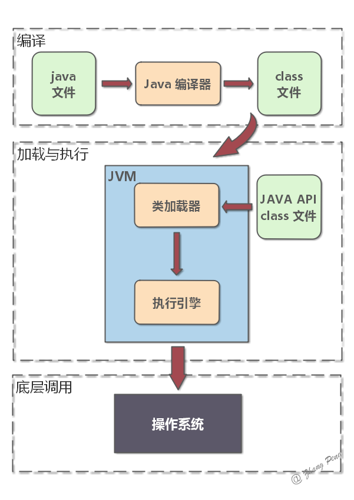
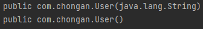
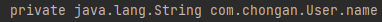
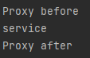
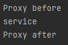

### 【java基础】反射机制

| Java反射机制允许允许中的Java程序获得自己的信息，操作类或对象的内部属性

#### 1. 反射概述

##### 1）反射概念

反射，顾名思义，就是从果导因，正常的java行为是从类到对象再到方法，而反射逆转了这一顺序，使得Java程序可以从对象得到类，进而重新实例化对象或者进行其他操作，示例如下，

```java
public class reflectionStudy {
    public static void main(String[] args) throws Exception {
        Class<?> userClass = Class.forName("com.chongan.User");
        Constructor constructor = userClass.getConstructor(String.class);
        User user = (User) constructor.newInstance("Hello");
        System.out.println(user.getName());
    }
}
```

##### 2）反射用途

- 通过反射机制，可以在运行时访问Java对象的属性、方法、构造方法等等
- 反射的主要用途有
  - **开发通用框架**，很多框架（例如Spring）需要通过配置文件加载不同的对象或类，调用不同的方法，这就需要使用反射来在运行时加载指定的对象
  - **动态代理**，所谓动态代理，其实就是在Java运行中动态的创建代理对象，这明显需要用到反射机制
  - **注解**，注解要需要应用反射在运行时根据注解标记调用执行器

#### 2. 反射原理与使用

##### 1）Class类

在学习反射原理之前，我们需要知道通过反射得到的Class类，到底是什么

- Class类也是一个实实在在的类，存在于java.lang包中，其实例表示java运行时的类或接口，每个Java类运行时在JVM中都会表现为一个Class对象



如上图所示，Java程序在编译过程中，首先由编译器将.java文件编译为.class文件，然后JVM识别.class文件，在内存中生成表示类的Class对象

通常所有使用反射的程序，都需要先获得待操作类的Class对象，其方法一般由以下三种

- Class.forName()，通过类的全限定名获得Class对象

```java
Class c1 = Class.forName("com.chongan.User");
```

- com.chongan.User.class，通过类名加.class获得Class对象

```java
Class c2 = com.chongan.User.class;
```

- user.getClass()，Object类中由getClass方法，所以所有类对象都可以调用getClass方法获得Class对象

```java
User user = new User("Jack");
Class c3 = user.getClass();
```

##### 2）Constructor类

在获得Class对象后，我们可以使用它来实例化对象，通常由两种方法

- Class对象的newInstance方法（JDK9之后被废弃）

```java
Class userClass = Class.forName("com.chongan.User");
User user = (User) userClass.newInstance();
```

- 使用Class对象获得Constructor对象，然后调用Constructor对象的newInstance方法

  - Class.getConstructor(String.class)，通过传入参数类型的Class对象，获得指定构造器

  ```java
  Constructor constructor1 = userClass.getConstructor(String.class);
  User user1 = (User) constructor1.newInstance("hello");
  ```

  - Class.getConstructors()，获得构造器列表

  ```java
  Constructor[] constructors = userClass.getConstructors();
  for (Constructor conTemp: constructors) {
      System.out.println(conTemp);
  }
  ```

  

- 获取Constructor还有getDeclaredConstructor()和getDeclaredConstructors()方法，这两个方法可以获得不为public的构造方法对应构造器，但是一般不使用

##### 3）Field类

在获得Class对象后，可以通过以下方法获得类的成员属性（Field）

- getFiled/getDeclaredField，根据名称获取public成员/所有成员

```java
Field fields = userClass.getDeclaredField("name");
```

- getFields/getDeclaredFields，获取所有public成员/所有成员

```java
Field[] fields = userClass.getDeclaredFields();
for (Field field : fields) {
    System.out.println(field);
}
```



##### 4）Method类

在获得Class对象后，可以通过以下方法获得类的成员方法（Method）

- getMethod/getDeclaredMethod，获得指定方法，第一个参数为方法名称，后面的参数为方法参数对应的Class对象

```java
Method getName = userClass.getMethod("setName", String.class);
System.out.println(getName);
```

- getMethods/getDeclaredMethods，获得所有方法

```java
Method[] declaredMethods = userClass.getDeclaredMethods();
for (Method method: declaredMethods) {
    System.out.println(method);
}
```

- 注意，获得方法不包括构造方法

在获得Method方法对象后，可以通过Method.invoke方法来调用，invoke方法源码如下，

```java
public Object invoke(Object obj, Object... args) {
    // 重写检查
    if (!override) {
        Class<?> caller = Reflection.getCallerClass();
        checkAccess(caller, clazz,
                    Modifier.isStatic(modifiers) ? null : obj.getClass(),
                    modifiers);
    }
    // 委派给MethodeAccessor处理
    MethodAccessor ma = methodAccessor;     
    if (ma == null) {
        ma = acquireMethodAccessor();
    }
    return ma.invoke(obj, args);
}
```

- MethodAccessor是一个接口，包含了一个invoke方法，它有两个实现
  - NativeMethodeAccessorImpl，本地方法实现反射调用
  - DelegatingMethodAccessorImpl，委派模式实现反射调用
- 每个Method实例第一次反射调用，都会生成一个DelegatingMethodAccessorImpl，它会委派一个本地实现NativeMethodAccessorImpl进行方法调用
- 使用委派实现来转发给本地实现进行方法调用，是因为本地实现相对较慢，所有Java还有一种动态生成字节码的实现方式，但是生成字节码十分耗时，所以一般只有多次调用方法时，才应该使用动态实现，Java设置了一个阈值15，某个反射调用次数在15以下时，委派实现转发给本地实现，15以上时，转发给动态实现
- invoke方法传入的第一个参数是调用方法的对象，后面的参数是方法的参数，示例如下

```java
Class userClass = Class.forName("com.chongan.User");
Method getName = userClass.getMethod("getName");
Object user = userClass.getConstructor(String.class).newInstance("hello");
String name = (String) getName.invoke(user);
System.out.println(name);
```

#### 3. 动态代理

| 关于代理模式的解释可见《【设计模式】代理模式》一文，此处只讨论代理模式的实现

##### 1）静态代理

- 静态代理由程序员自己创建代理类，在运行前，代理类的class已经被创建了。

```java
//服务接口
public interface Service {
    public void service();
}
```

```java
//服务类
public class ServiceImpl implements Service{
    @Override
    public void service() {
        System.out.println("service");
    }
}
```

```java
//代理类
public class Proxy implements Service{
    private Service service;

    public Proxy(Service service) {
        this.service = service;
    }

    @Override
    public void service() {
        System.out.println("Proxy before");
        service.service();
        System.out.println("Proxy after");
    }
}
```

```java
public class Client {
    public static void main(String[] args) throws InterruptedException {
        ServiceImpl service = new ServiceImpl();
        Proxy proxy = new Proxy(service);
        proxy.service();

    }
}
```

测试结果，



##### 2）JDk动态代理

JDK动态代理通过JDK未拥有接口的类实现代理，我们不再手动创建代理类，只需要编写一个动态代理处理器即可（下面的代码省去Service接口和ServiceImpl类）

```java
//动态代理类
public class DynamicProxy implements InvocationHandler {
    private Service service;

    public DynamicProxy(Service service) {
        this.service = service;
    }

    @Override
    public Object invoke(Object proxy, Method method, Object[] args) throws Throwable {
        System.out.println("Proxy before");
        Object result = method.invoke(service, args);
        System.out.println("Proxy after");
        return result;
    }
}
```

```java
public class Client {
    public static void main(String[] args) throws InterruptedException {
        Service service = new ServiceImpl();
        DynamicProxy dynamicProxy = new DynamicProxy(service);
        Service proxy = (Service) Proxy.newProxyInstance(
                ClassLoader.getSystemClassLoader(),
                new Class[]{Service.class},
                dynamicProxy
        );
        proxy.service();
    }
}
```



##### 3）CGLIB动态代理

CGLIB使用字节码技术，通过字节码技术为一个类创建子类，并在子类中拦截所有父类方法的调用，所以可以对没有接口的类进行动态代理。它创建的动态代理对象比JDK的动态代理对象性能更强，但是花费的时间更多。

#### 参考资料

- [深入理解Java反射和动态代理](https://dunwu.github.io/javacore/basics/java-reflection.html#_3-7-method)
- [java的动态代理机制详解](https://www.cnblogs.com/xiaoluo501395377/p/3383130.html)

- [java动态代理机制详解（JDK和CGLIB，Javassist，ASM）](https://blog.csdn.net/luanlouis/article/details/24589193)
