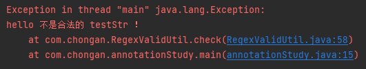

### 【java基础】注解机制

| 注解是JDK1.5引入的新特性，它以一种类似于注释的方式为程序的元素提供说明

#### 1. 注解概述

##### 1）注解的形式

在解释注解具体是什么之前，我们先来看以下注解到底长什么样子

```java
@Override
void myMethod() { ... }
```

```java
@Author(
	name = "Chongan",
    date = "1/7/2022"
)
class myClass { ... }
```

如上述代码所示，注解就是以@开头的一个单词，然后可以在后面的括号中包含参数名和属性值，其中没有属性被叫做标记注解；

##### 2）注解概念和用途

- 注解可以视为一种特殊的注释，但拥有比注释更丰富的功能，可以对所标记的内容进行处理

- 注解通常有两种解析方式
  - **编译器直接扫描**，编译器在将Java代码编译为字节码的过程中，对注解进行处理（JDK内置注解）
  - **运行期反射**，通过反射技术，在运行时获取注解修饰的元素，然后进行处理
- 注解有许多用途
  - 生成文档（@param，@author等等）
  - 编译检查（@Override）
  - 抑制警告（@SuppressWarnnings）
  - 等等

#### 2. Java内置注解

JDK8有五个内置注解，分别如下

##### 1）@Override

- 用于修饰覆写了父类方法的子类方法

```java
public interface myInterface() {
    public void myMethod();
}

public Class myClass implement myInterface {
	@Override
    public void myMethod() {
   		...
    }  
}
```

##### 2）@Deprecated

- 用于表明修饰的元素（类、成员、方法）以被废弃，不建议使用
- @Depracated可以被继承，对于标记了的类的子类，也会有警告

```java
@Deprecated
public class deprecatedClass { ... }
```

##### 3）@SuppressWarnnings

- 用于抑制警告信息，接收一个String[]类型的参数，表示要抑制的警告类型
- 常见参数解释如下，
  - deprecation - 使用了不赞成使用的元素的警告
  - unchecked - 使用了未检查的转换的警告
  - fallthrough - swith的case中没有break的警告
  - path - 路径不存在的警告
  - all - 所以警告

```java
@SuppressWarnings("all")
public class annotationStudy {
    public static void main(String[] args) {
        ...
    }
}
```

##### 4）@ SafeVarargs（JDK7+）

- 表示修饰的方法的可变长参数中的泛型是类型安全的

##### 5）@FunctionalInterface（JDK8+）

- 表示修饰的接口是函数式接口

- 函数式接口解释有且只有一个抽象方法，可以有多个非抽象方法的接口

```java
@FunctionalInterface
public interface myFunctionalInterface {
    public void myMethod();
    public default void testMethod() {
        System.out.println("hello");
    }
}
```

#### 3. Java元注解

大家平时应该都见过各种各样的注解，比如Spring中的@Controller、@Service等等，这些注解都不是Java内置的，而是其他开发人员使用Java提供的元注解定义的

- 元注解就算是用来定义注解的注解

JDK8有五个元注解，分别如下，

##### 1）@Retention

- 指明注解的保留级别

- 源码

```java
@Documented
@Retention(RetentionPolicy.RUNTIME)
@Target(ElementType.ANNOTATION_TYPE)
public @interface Retention {
    RetentionPolicy value();
}
```

- 接收一个RetentionPolicy枚举类型的参数

```java
public enum RetentionPolicy {
    SOURCE,   // 标记的注解在源文件中有效，编译器会忽略
    CLASS,    // 标记的注解在class文件中有效，JVM会忽略
    RUNTIME   // 标记的注解在运行时有效
}
```

##### 2）@Documented

- 表示注解是否包含在javadoc中

##### 3）@Target

- 指明注解可以修饰的元素种类

- 源码

```java
@Documented
@Retention(RetentionPolicy.RUNTIME)
@Target(ElementType.ANNOTATION_TYPE)
public @interface Target {
    ElementType[] value();
}
```

- 接收一个ElementType数组作为参数ElementTye是一个枚举类型

```java
public enum ElementType {
    TYPE,             // 标记的注解可以应用于类和接口
    FIELD,            // 标记的注解可以应用于字段
    METHOD,           // 标记的注解可以应用于方法
    PARAMETER,        // 标记的注解可以应用于方法的参数
    CONSTRUCTOR,      // 标记的注解可以应用于构造函数
    LOCAL_VARIABLE,   // 标记的注解可以应用于局部变量
    ANNOTATION_TYPE,  // 标记的注解可以应用于注解
    PACKAGE,          // 标记的注解可以应用于包声明
    TYPE_PARAMETER,
    TYPE_USE,
    MODULE,
    RECORD_COMPONENT;
}
```

##### 4）@Inherited

- 表示修饰的注解可以被继承（只有父类到子类的继承，方法、接口不继承）

##### 5）@Repeatable

- 表示注解可以重复使用
- 例如Spring的@Scheduled

```java
public class myScheduled {
	@Scheduled("1 2 * * ?")
    @Scheduled("6 7 8 * ?")
    public void scheduled1() { ... }
}
```

#### 4. 自定义注解

接下来我们通过自己实现用于正则表达式检查的注解来进一步较少对注解的理解

##### 1）注解定义

通过下述语句可以定义一个注解

```java
public @interface myAnnotation { ... }
```

例如我们定义RegexValid注解

```java
@Documented
@Target({ElementType.FIELD, ElementType.PARAMETER})
@Retention(RetentionPolicy.RUNTIME)
public @interface RegexValid { }
```

##### 2）注解属性

通过下述语句可以在注解中定义属性

```java
[修饰符(public)] [数据类型(String)] value() default ""; 
```

- 注解的属性名后面需要加括号，并通过default指定其默认值
- 如果注解中只有一个输出，且属性名为value，则在使用注解时可以不用指定属性名称

例如我们为RegexValid定义属性

```java
package com.chongan;

import java.lang.annotation.*;

@Documented
@Target({ElementType.FIELD, ElementType.PARAMETER})
@Retention(RetentionPolicy.RUNTIME)
public @interface RegexValid {
    enum Policy {
        EMPTY(null),
        DATE("^(?:(?!0000)[0-9]{4}([-/.]?)(?:(?:0?[1-9]|1[0-2])\\1(?:0?[1-9]|1[0-9]|2[0-8])|(?:0?[13-9]|1[0-2])\\1"
                + "(?:29|30)|(?:0?[13578]|1[02])\\1(?:31))|(?:[0-9]{2}(?:0[48]|[2468][048]|[13579][26])|"
                + "(?:0[48]|[2468][048]|[13579][26])00)([-/.]?)0?2\\2(?:29))$"),
        MAIL("^[A-Za-z0-9](([_\\.\\-]?[a-zA-Z0-9]+)*)@([A-Za-z0-9]+)(([\\.\\-]?[a-zA-Z0-9]+)*)\\.([A-Za-z]{2,})$");

        private String policy;

        Policy(String policy) {
            this.policy = policy;
        }

        public String getPolicy() {
            return policy;
        }
    }

    String value() default "";
    Policy policy() default Policy.EMPTY;
}
```

我们为RegexValid定义了两个属性

- String的value
- Policy枚举类型的policy

##### 3）注解处理器

注解需要注解处理器来进行分析处理，注解处理器通常通过反射获得指定元素的注解对象，然后读取注解对象的数据进行处理

```java
package com.chongan;

import java.lang.reflect.Field;
import java.util.regex.Matcher;
import java.util.regex.Pattern;

public class RegexValidUtil {
    public static boolean check(Object obj) throws Exception {
        boolean result = true;
        StringBuilder stringBuilder = new StringBuilder();
        // 使用getClass方法获得obj的Class
        // 使用getDeclaredFields方法获得obj的所有成员
        Field[] fields = obj.getClass().getDeclaredFields();
        for (Field field: fields) {
            // 判断是否带有@RegexValid注解
            if (field.isAnnotationPresent(RegexValid.class)) {
                // 通过getAnnotation方法获得注解对象
                RegexValid valid = field.getAnnotation(RegexValid.class);
                // 获得注解对象的属性
                String value = valid.value();
                // 如果没有定义value属性，则使用policy属性
                if ("".equals(value)) {
                    RegexValid.Policy policy = valid.policy();
                    value = policy.getPolicy();
                }

                // 设置setAccessible来访问私有成员
                field.setAccessible(true);
                Object fieldObj = null;
                try {
                    // 获取obj对象的field的值
                    fieldObj = field.get(obj);
                } catch (IllegalAccessException e) {
                    e.printStackTrace();
                }
                if (fieldObj == null) {
                    stringBuilder.append("\n")
                            .append(String.format("%s 类中的 %s 字段不能为空！", obj.getClass().getName(), field.getName()));
                    result = false;
                } else {
                    if (fieldObj instanceof String) {
                        // 进行正则式匹配以验证fieldObj值的正确性
                        String text = (String) fieldObj;
                        Pattern p = Pattern.compile(value);
                        Matcher m = p.matcher(text);
                        result = m.matches();
                        if (!result) {
                            stringBuilder.append("\n")
                                    .append(String.format("%s 不是合法的 %s ！", text, field.getName()));
                        }
                    } else {
                        stringBuilder.append("\n").append(
                                String.format("%s 类中的 %s 字段不是字符串类型，不能使用此注解校验！", obj.getClass().getName(), field.getName()));
                        result = false;
                    }
                }
            }
        }
        if (stringBuilder.length() > 0)
            throw new Exception(stringBuilder.toString());
        return result;
    }
}
```

- 其中几个重要的方法
  - obj.getClass() - 获取obj对象的Class
  - objClass.getDeclaredFields() - 获得objClass的所有声明的Field
  - field.isAnnotationPresent(xxx.class) - 判断是否别xxx注解修饰
  - field.getAnnotation(xxx.class) - 获取field的xxx注解对象

##### 4）使用注解

```java
public class annotationStudy {
    static class testClass {
        @RegexValid(policy = RegexValid.Policy.DATE)
        private String testStr;

        public testClass(String testStr) {
            this.testStr = testStr;
        }
    }

    public static void main(String[] args) throws Exception {
        testClass testClass = new testClass("hello");
        if(RegexValidUtil.check(testClass))
            System.out.println("true");
        else
            System.out.println("false");
    }
}
```

执行结果



#### 参考资料

- [深入理解Java注解](https://dunwu.github.io/javacore/basics/java-annotation.html#_5-%E5%B0%8F%E7%BB%93)
- [深入理解Java：注解（Annotation）自定义注解入门](https://www.cnblogs.com/peida/archive/2013/04/24/3036689.html)

